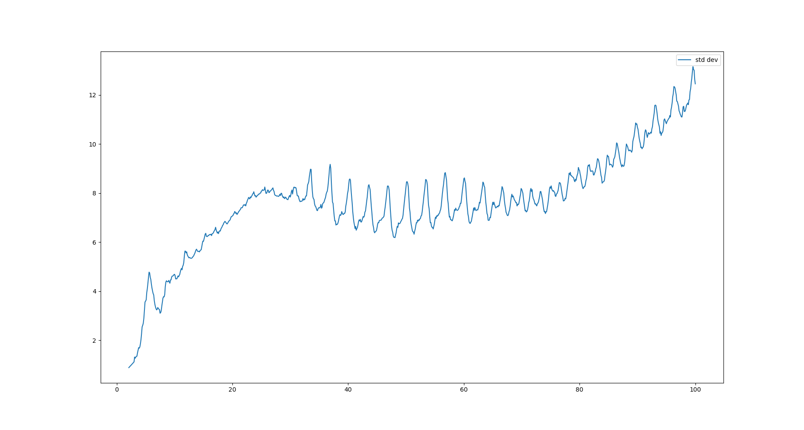
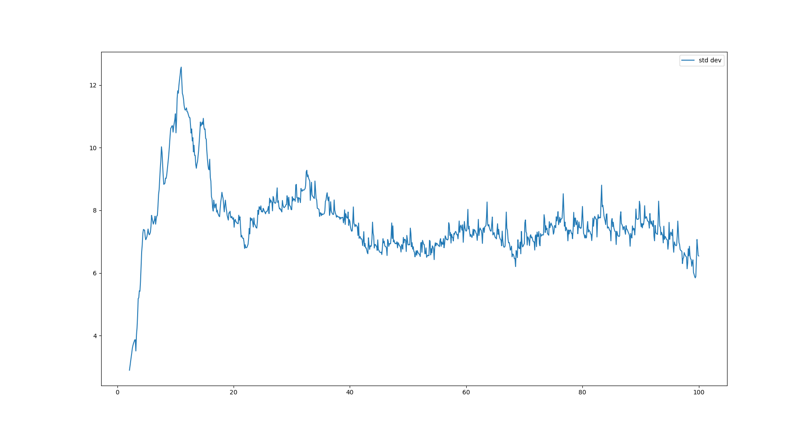

# Hexapod-Control-Gradient-Descent

Gradient based control of hexapod robot 'Daisy' using force feedback
Since the work is not published yet, I cannot share our code base for the controller. However, I have some plots and videos:

## Uneven terrain

 

 Without gradient based control(left)                     with gradient based control (right)

## Smooth terrain

 Without gradient based control(left)                     with gradient based control (right)
 
## Plots

 Without gradient based control(left)                     with gradient based control (right)
 
 The graph should ideally be converge to 'zero' signifying equal workload distribution on each leg.
 
 ## All Videos
https://drive.google.com/drive/folders/16vyU0-7pZt6hR2acLCtNc61eJzKQQNqU?usp=sharing
